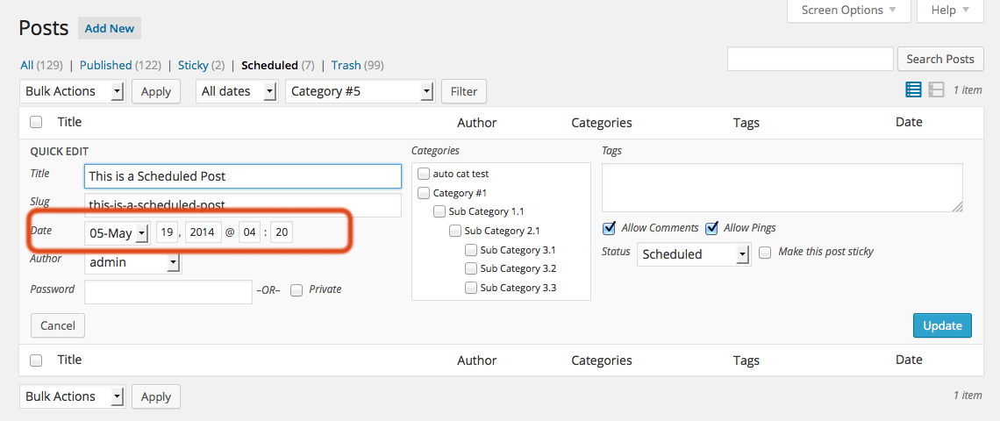

# Automatic Post Publishing Scheduler #

**Contributors:** WilltheWebMechanic
**License:** GPLv3.0+
**Requires at least:** 3.6
**Tested up to:** 4.4.1
**Stable tag:** 2.1.6
**Tags:** posts, publishing, scheduling, admin, author, automatic, blog, free, plugin
**Donate Link:** http://www.willthewebmechanic.com/automatic-post-publishing-scheduler/

Schedule posts LIKE A BOSS!! Define time slots for publishing and forget about it.

## Description ##

This plugin allows you to gain very precise control over when posts are published to your site.

### Features ###

1. Allows the creation of any number of time slots for post publishing
2. Admin users are able to allow or disallow publishing on any given day(s) of the week through a simple interface
3. Further control is allowed by specifying dates that will be explicitly allowed (or disallowed) for publishing, thereby overriding the weekday setting - as an example, if your publishing schedule allows for publishing on Tuesday, but a major holiday falls on Tuesday and you don\'t want publishing to take place on that particular Tuesday, simply specify it in the easy-to-use interface.
4. Any admin/editor user can publish a post 'NOW' by clicking the "publish now" link in the posts screen.
5. Any admin/editor user can alter the scheduled date by using the quick-edit screen.
6. Normal users (authors, etc) can alter the scheduled time/date of their posts, but the defined time slots will still be respected.

## Installation ##

### Option 1 ###
* Within your WordPress admin area, navigate to "Plugins".
* Click the "Add New" link near the top of your screen.
* Click the "Upload" link.
* Click the browse button and navigate to wherever you downloaded the zip file to, select the zip file
* Click the "Install Now" button
* Click "Activate Plugin"

### Option 2 ###
* Extract the zip file
* Upload (ftp) the resulting `automatic-post-publishing-scheduler` folder to your `/wp-content/plugins/` directory.
* Activate "Automatic Post Publishing Scheduler" through the "Plugins" menu in WordPress

### After Installation: ###
* Once activated, your admin menu will have an item labeld "WtWM Plugins", that item has a submenu item called "Scheduler", this is where you can configure your settings.
* Rejoice in how amazingly awesome your posts can now be scheduled.

## Frequently Asked Questions ##

### How can I support the development of this plugin? ###

### The most obvious way is to [donate](http://www.willthewebmechanic.com/automatic-post-publishing-scheduler/ "Support Future Development"). However, there are many other ways that you can contribute. ###
* By simply [rating](http://wordpress.org/support/view/plugin-reviews/automatic-post-publishing-scheduler "Review this plugin") this plugin you provide me valuable feedback on what is important to the users of this plugin.
* If you find a bug, report it in the [support forums](http://wordpress.org/support/plugin/automatic-post-publishing-scheduler "Get Support").
* If you would like to see more features, [let me know](http://wordpress.org/support/plugin/automatic-post-publishing-scheduler "Feature Request").
* Can you provide artwork for the banner or other assets? Please do - I'll put your name in pixels and will be forever grateful.
* Are you a developer and would like to contribute code to this plugin? Find me on [github](https://github.com/WillBrubaker/automatic-post-publishing-scheduler "Fork Me") and send a pull request (which will also result in your name in pixels).
* [Tweet](http://ctt.ec/BIYrv "Shout it From the Rooftops") about this plugin, write about it on your blog.
* Any of the above actions are truly and greatly appreciated!

## Screenshots ##

###1. The admin menu item that this plugin creates and the links to the plugin settings/configuration.###

###2. Time slot configuration - simple!.###

###3. Configuration of allowed/disallowed days of the week.###

###4. Configuration of explicitly allowed/disallowed dates.###

###5. The datepicker implementation.###

###6. The 'Publish Now' link - available only to Admin users.###

###7. The "Quick Edit" interface. Admin users can override scheduled time/date here.###

## Changelog ##

### v2.1.6 ###
1. Second attempt at getting post_date_gmt right

### v2.1.5 ###
1. Better handling of WordPress timezone settings

### v2.1.4 ###
1. Add handling for XML-RPC requests

### v2.1.3 ###
1. Tested against WordPress 4.4
2. Cleaned up some PHP notices
3. updated external assets

### v2.1.2 ###

1. Removed some spammy links
2. Tested with WordPress 4.3 RC2
3. PHP array index checking added where it didn't exist before
4. Brought external assets (jQuery UI CSS) up to date

### v2.1.1 ###

1. Bug fix - Post by users with the role of "Contributor" were bypasssing the review process and going directly to the schedule queue. Fixed. Thanks to @Dreamerspodcast for the bug report!

### v2.1 ###

1. New Feature - admin users can allow editors/admins to override automatic scheduling

### v2.0.3 ###

1. Minor bug fix

### v2.0.2 ###

1. Minor UI improvements

### v2.0.1 ###

1. You spoke, I listened! New feature added. This plugin will now auto-schedule posts that are created with the "Automatic Featured Image Posts" plugin.
2. Much progress made towards making this plugin translation friendly
3. Minor code optimizations
4. **Bug Fix** included/excluded dates input should now be working.

### v2.0 ###
* Version 2.0 is a major re-do of this plugin, inspired by my recent attendace of WordCamp Miami. Huge shouts to all the people there who inspired me and inspired the re-write of this plugin.

1. Premium features are now **FREE!!**

### v1.3 ###

1. minor changes and improvements in efficiency

### v1.2 ###

1. Just fixing a typo. Thanks Joseph the random passer-by.

### v1.1 ###

1. Now with actual php file goodness.

### v1.0 ###

1. Initial Public Release

## Additional Information ##

### Known Issues: ###

*	At this time, even though duplicate time slots are allowed, they are not working. For best results, avoid duplicating time slots.

### To Do List ###
* Improvements to UI
* Code optimization and constant improvement
* More features
 * Allow custom post types to be assigned to the schedule
 * Display upcoming time slots in the post editor and allow post authors to select their time slot
* Make the plugin internationalization friendly
* Use local date/time format settings when outputting dates/times
* User customization of the pop-up message that is displayed when a post is scheduled.
* **Your feature request here.**

### Credits ###
* **Your name could be here** make a contribution today! (see the FAQ for suggestions of how you can help with the development)
